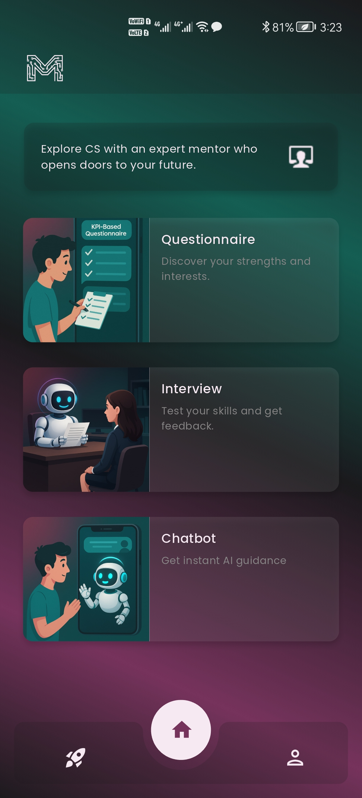
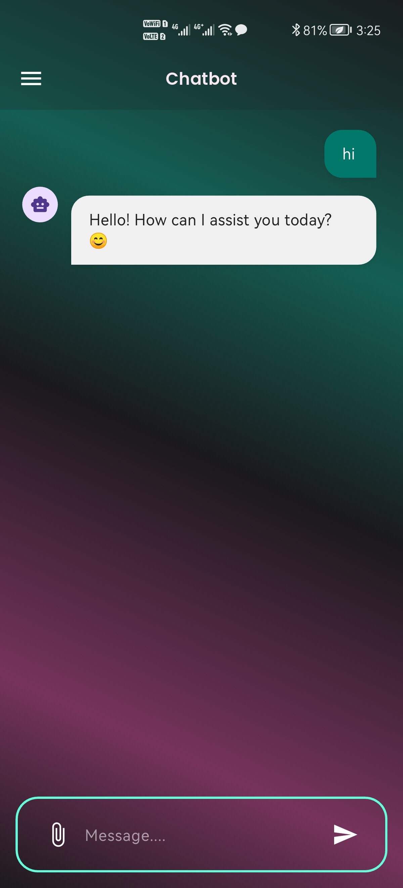
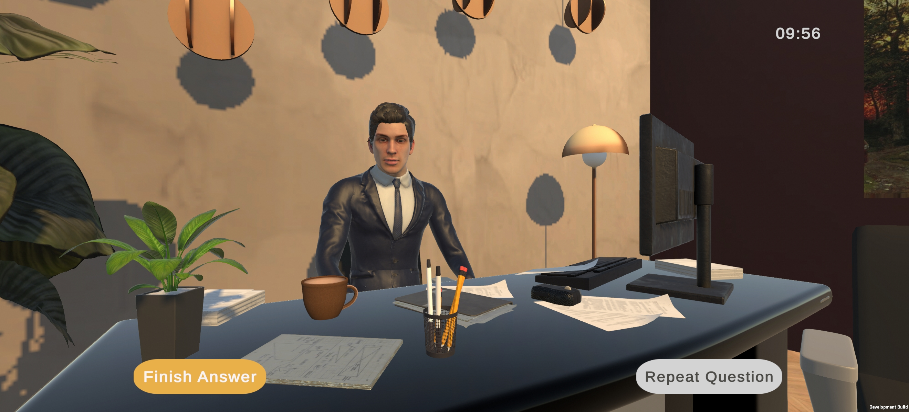
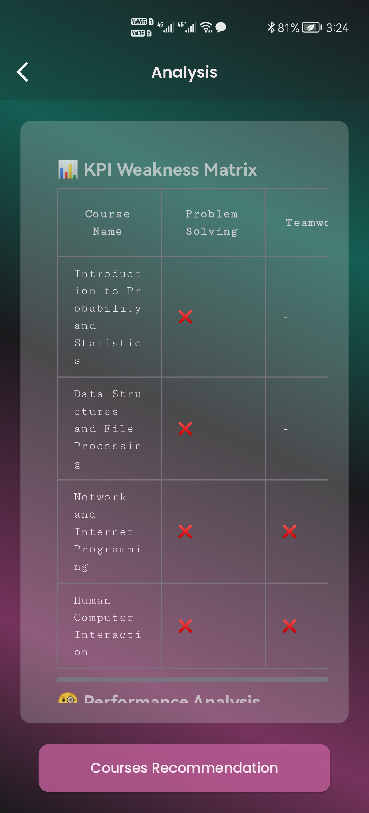
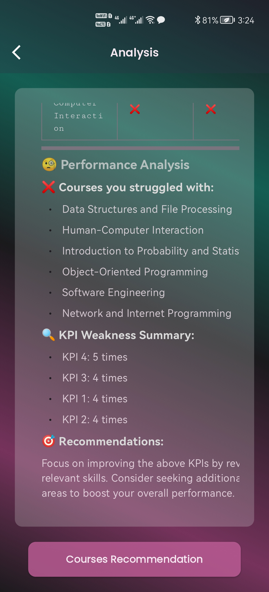
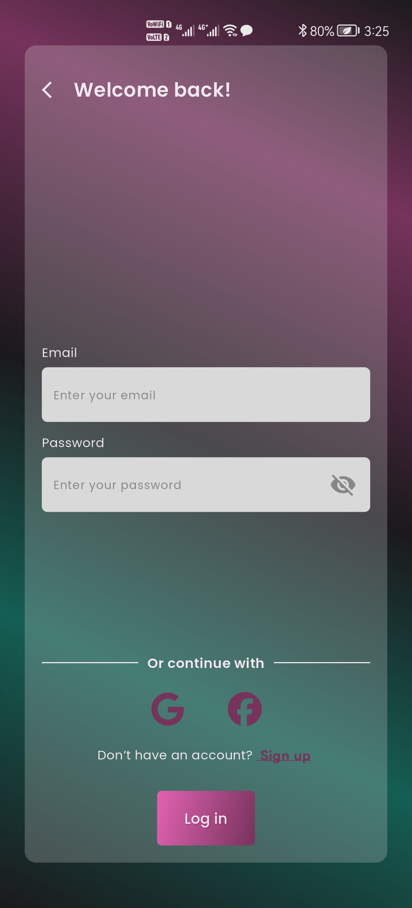
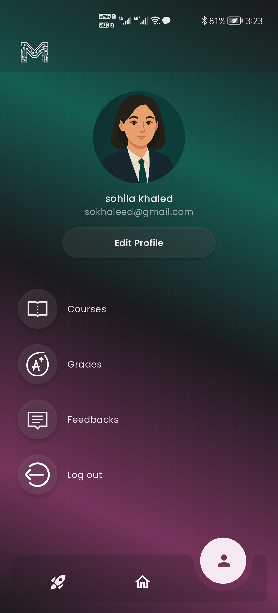
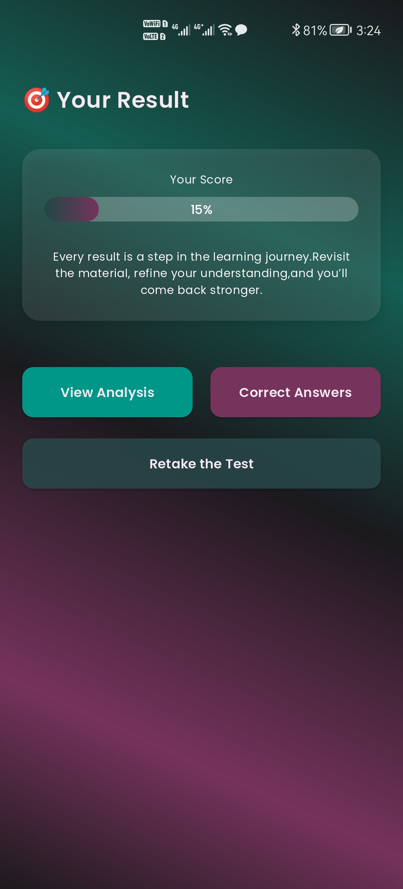

# 🎓 MentroMate – Your AI-Powered Academic Career Mentor

MentroMate is a mobile application designed to help **Computer Science students** identify their academic strengths and weaknesses through **AI-driven feedback and ABET-aligned KPIs**.  
It acts as a **personal AI mentor** that provides **course recommendations, mock interview simulations, and real-time feedback** — helping students grow both technically and professionally.

---

## 🚀 Key Features

### 🧩 1. KPI-Based Assessment
- Interactive questionnaire that evaluates a student’s performance across **ABET-aligned KPIs** (Problem Solving, Teamwork, Communication, and Application of Knowledge).  
- Generates a personalized **KPI-Course Matrix** that highlights weak areas and suggests matching courses.

### 🤖 2. AI Chatbot Mentor
- Integrated **AI chatbot** that provides instant feedback, career advice, and tailored course suggestions.  
- Delivers intelligent conversation based on a student’s performance and quiz analysis.

### 🗣️ 3. Mock Interview Simulation
- Live **AI-powered interview sessions** with real-time feedback.  
- Assesses communication, confidence, and technical understanding.  
- Provides a post-interview report with actionable insights.

### 🧠 4. Personalized Learning Recommendations
- MentroMate suggests **targeted courses** and resources from platforms like Coursera, Udemy, and DataCamp.  
- Helps students track progress and improve in weaker KPI areas.

### 📊 5. Data-Driven Insights
- Analyzes quiz results, tracks improvements, and visualizes progress.  
- Helps users understand their academic and career readiness.

---

## 🧰 Tech Stack

| Category | Tools / Technologies |
|-----------|----------------------|
| **Frontend** | Flutter, Dart |
| **Backend / Database** | Firebase, Cloud Firestore |
| **AI Integration** | Custom NLP-based chatbot, Real-time feedback engine |
| **State Management** | Provider, Bloc |
| **Authentication** | Firebase Auth |
| **Design** | Figma |
| **Version Control** | Git, GitHub |

---

## 📱 App Screenshots

  
  
  
  
  
  
  
  
  

---
## 🧠 Future Enhancements
- Add **voice-based chatbot** and **video feedback**.  
- Implement **student progress analytics dashboard**.  
- Integrate **machine learning model** for improved KPI prediction accuracy.  

---

⭐ **“Learn, reflect, and grow — with MentroMate.”**

